# Q - System 
## Instalación y Configuración Inicial
### Clonar el Repositorio

```
git clone https://github.com/AlexanderAndreChavezCabana/qsystem-api.git
cd tu-repositorio
```
### Crear y Activar el Entorno Virtual
```
python3.10 -m venv venv
source venv/bin/activate
```
### Instalar Dependencias del Proyecto
```
pip install -r requirements.txt
```

### Ingresar a la carpeta del proyecto, aplicar  migraciones y correr el sistema
```
cd app
# De ser necesario aplicar migraciones, en este caso el proyecto y base de datos se subieron completo para las pruebas respectivas
python manage.py makemigrations
python manage.py migrate

# Correr el sistema
python manage.py runserver
```

## Prueba técnica
### Ejercicio # 1

- Crear una lista del Objeto Persona (dni, appPaterno, appMatterno) y deberás ordenar la lista por DNI y de ahí por apellido paterno, pintando la lista desordenada y de ahí ordenada. La información debe ser obtenida por una pequeña base de datos con estos tres datos. Incluya las sentencias en SQL para poder obtener los datos y la integración para obtener la consulta.

### Ejercicio # 2 

- Se requiere la construcción de un REST API, que transmita la lista del Objeto Persona.  

### Ejercicio #3

- Es necesario implementar la función de consulta a través de una aplicación tercera para poder asegurar que toda la prueba está corriendo adecuadamente. 
- Para poder probarlo, es importante que pueda existir al menos una llamada usando herramientas terceras como el SOAP UI

# Ejercicios Resueltos
## Ejercicio #1: Crear y Ordenar Lista de Personas

### *models.py*
```
#models.py
from django.db import models

# Models Persona
class Persona(models.Model):
    dni = models.CharField(max_length=10)
    appPaterno = models.CharField(max_length=255)
    appMaterno = models.CharField(max_length=255)
    created_at = models.DateTimeField(auto_now_add=True)
    updated_at = models.DateTimeField(auto_now=True)

    def __str__(self):
        return f"{self.dni} - {self.appPaterno} {self.appMaterno}"
    
    class Meta:
        ordering = ['-created_at']
```
#### Captura models.py
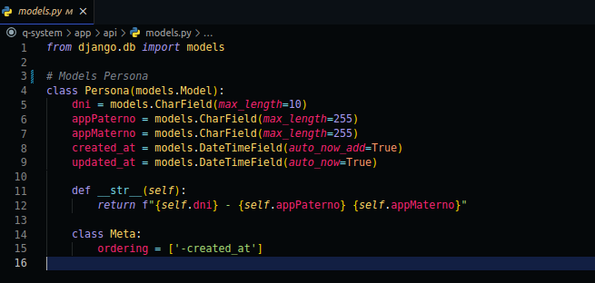


#### Consultas SQL para listas
```
# Obtener la Lista Desordenada
SELECT * FROM api.persona;

# Obtener la Lista Ordenada por DNI, Apellido Paterno y Apellido Materno
SELECT * FROM api.persona ORDER BY dni, appPaterno, appMaterno;
```

## Ejercicio #2: Construcción de REST API
### *serializers.py*
```
# serializers.py
from rest_framework import serializers
from .models import Persona

# Serializer Persona
class PersonaSerializer(serializers.ModelSerializer):
    class Meta:
        model = Persona
        fields = '__all__'
```

#### Captura serializers.py
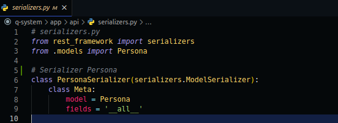

### *urls.py*
```
from django.urls import include, path
from drf_spectacular.views import SpectacularAPIView, SpectacularSwaggerView
from rest_framework import routers
from rest_framework_extensions.routers import ExtendedSimpleRouter
from rest_framework_simplejwt.views import TokenObtainPairView, TokenRefreshView, TokenVerifyView

# View Set Persona
from api.views import PersonaViewSet

router = ExtendedSimpleRouter()

router.register(r'personas', PersonaViewSet, basename='persona')

urlpatterns = [
    path('', include(router.urls)),

    # Rutas adicionales
    path('schema/', SpectacularAPIView.as_view(), name='schema'),
    path('schema/swagger/', SpectacularSwaggerView.as_view(url_name='api:schema'), name='swagger'),
    path('token/', TokenObtainPairView.as_view(), name='token_obtain_pair'),
    path('token/refresh/', TokenRefreshView.as_view(), name='token_refresh'),
    path('token/verify/', TokenVerifyView.as_view(), name='token_verify'),
]
```

#### Captura urls.py
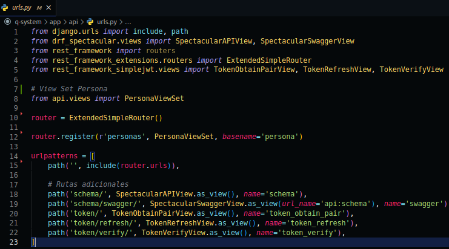

### *views.py*
```
from django.urls import include, path
from drf_spectacular.views import SpectacularAPIView, SpectacularSwaggerView
from rest_framework import routers
from rest_framework_extensions.routers import ExtendedSimpleRouter
from rest_framework_simplejwt.views import TokenObtainPairView, TokenRefreshView, TokenVerifyView

from api.views import PersonaViewSet

# En lugar de usar DefaultRouter, utiliza ExtendedSimpleRouter
router = ExtendedSimpleRouter()

# Registra la vista PersonaViewSet con el router
router.register(r'personas', PersonaViewSet, basename='persona')

urlpatterns = [
    # Rutas generadas por el router extendido
    path('', include(router.urls)),

    # Rutas adicionales
    path('schema/', SpectacularAPIView.as_view(), name='schema'),
    path('schema/swagger/', SpectacularSwaggerView.as_view(url_name='api:schema'), name='swagger'),
    path('token/', TokenObtainPairView.as_view(), name='token_obtain_pair'),
    path('token/refresh/', TokenRefreshView.as_view(), name='token_refresh'),
    path('token/verify/', TokenVerifyView.as_view(), name='token_verify'),
]
```

#### Captura views.py
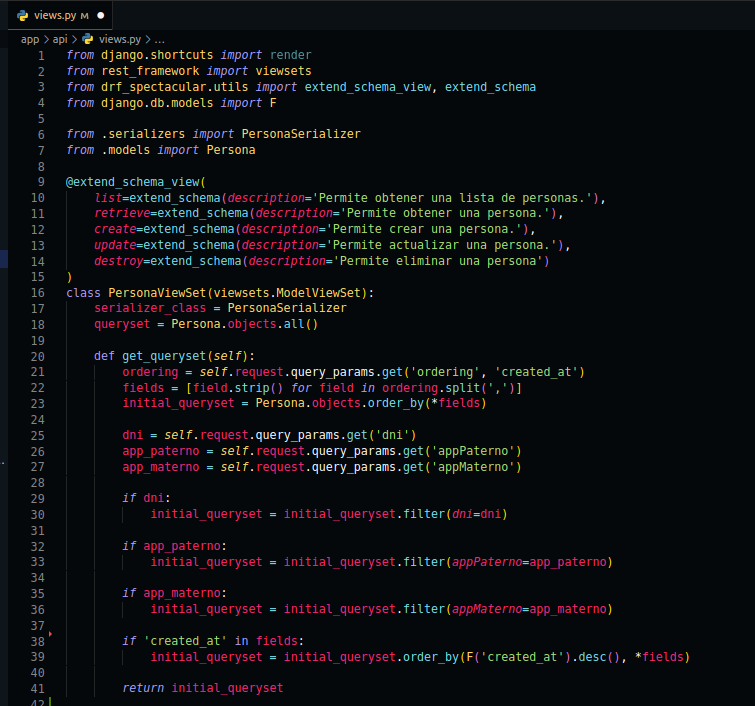


### Ver Swagger UI:
Abre tu navegador web y ve a la siguiente dirección: http://127.0.0.1:8000/api/schema/swagger/#/

Esto debería abrir el Swagger UI, donde podrás ver la documentación interactiva de tu API y probar los endpoints directamente desde la interfaz de usuario.

#### Captura de Pantalla de Swagger UI
- Swagger UI mostrando la documentación de la API:

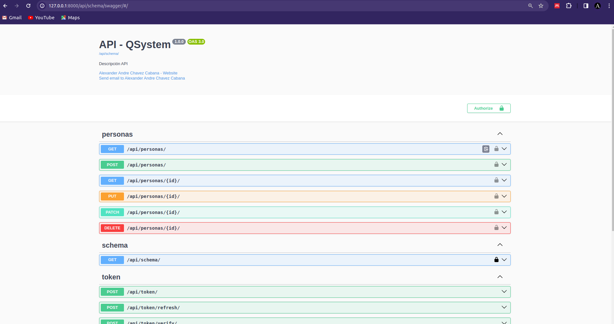

### Generar Token:

1. Dirigete hasta la sección "Token" y haz clic en "Try it out!".
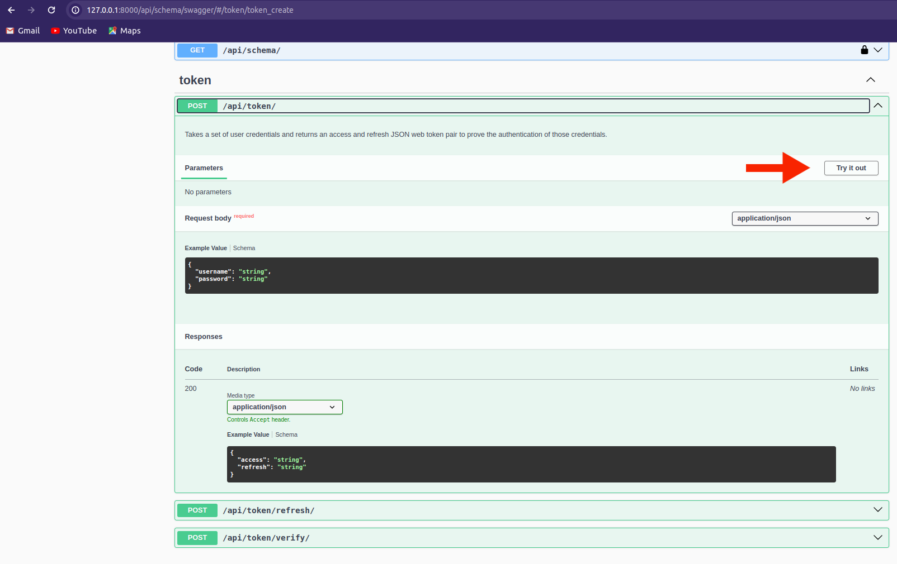
2. Llena los parámetros requeridos, en este caso con las credenciales *{ "username": "chavez", "password": "chavez" }* y ejecuta:
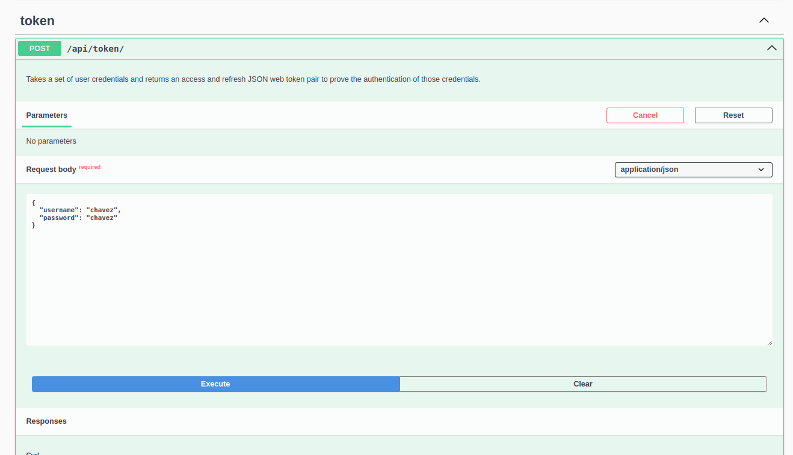


   #### Captura de pantalla: Token Obtenido
   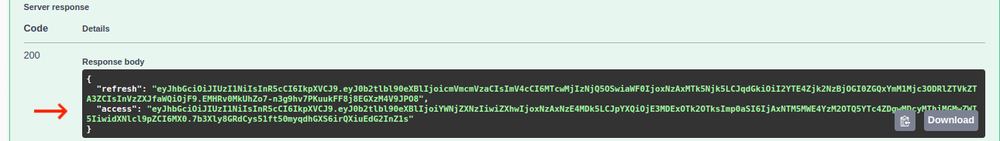

### Realizar una Solicitud con Token:

1. Utiliza el token obtenido para realizar solicitudes a recursos protegidos.
    #### Utilizar token en Swagger
    1. Dirigete hasta la parte superior y presiona en authorize e inserta el token mostrada en la imagen anterior (en tu caso se mostrará otro token, inserta el obtenido).
    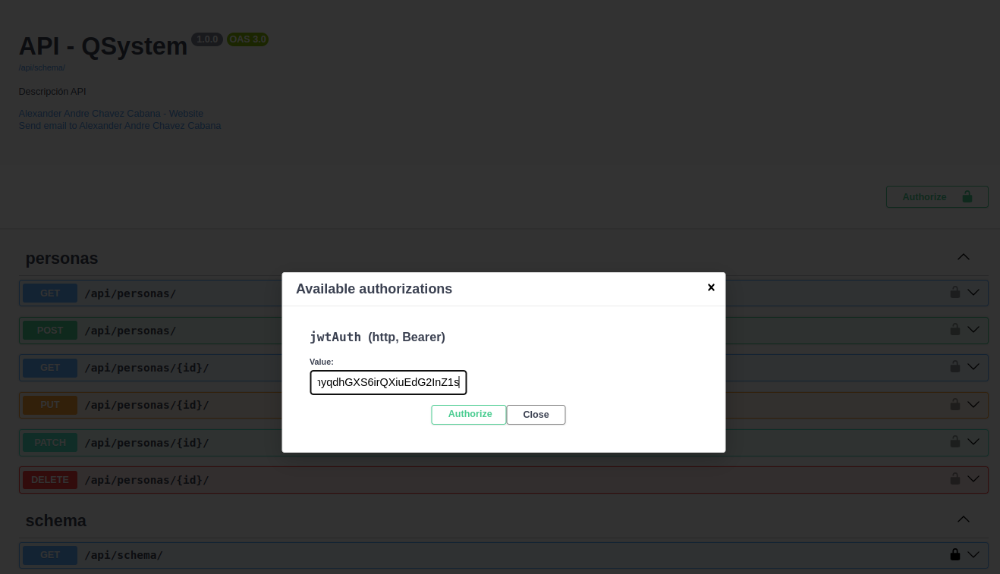


    2. Puedes hacerlo utilizando la operación dirigiendote a la `get personas` bajo la sección "personas".

   #### Captura de pantalla: Solicitud con Token
   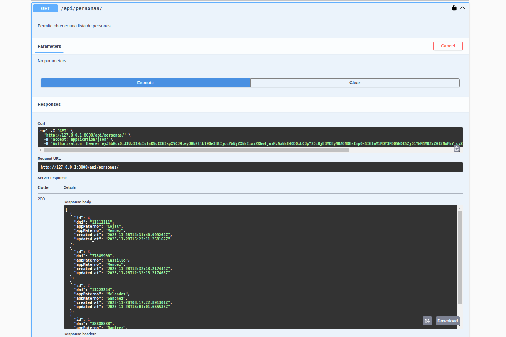

## Ejercicio #3: Implementación de Consulta con SOAP UI

### Importar el Proyecto en SOAP UI

Para comenzar las pruebas con la API REST de Personas, necesitarás importar el proyecto en SOAP UI utilizando el archivo de configuración provisto.

#### Pasos para la Importación

1. Inicia SOAP UI.
2. Dirígete a la opción `File > Import Project`.
3. Navega hasta la ubicación del archivo `REST-QSystem-Personas-soapui-project.xml`, que se encuentra dentro de la carpeta `SOAP file`.
   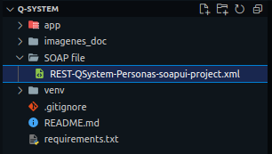
4. Selecciona el archivo y permite que SOAP UI complete el proceso de importación.

### Ejecutar Consultas con SOAP UI

Una vez importado el proyecto, sigue estos pasos para ejecutar las consultas:

1. Expande el proyecto `REST QSystem Personas` en la barra lateral de SOAP UI.
2. Dentro del proyecto, verás una lista de consultas preconfiguradas listas para ser ejecutadas.
3. Selecciona la consulta que deseas probar, como `PersonasLista`, `ListaPorFechaCreacion`, o `OrdenarDniPaternoMaterno`.

   ### Captura de Pantalla - Importación en SOAP UI:
   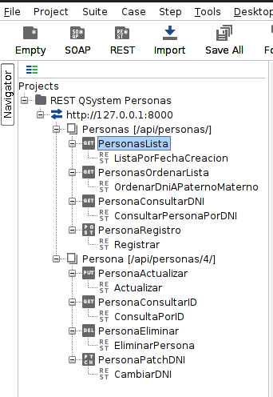


### Configuración de Autenticación en SOAP UI

Para ejecutar consultas autenticadas contra la API, debes incluir un token de acceso válido en la solicitud. Aquí se muestra cómo configurar el token de acceso en SOAP UI para el endpoint `ListaPorFechaCreacion`.

#### Obtención del Token de Acceso

i. Si aún no tienes un token, puedes obtener uno utilizando la función 'Get Token' de SOAP UI.
ii. Si ya tienes un token de la sesión anterior, puedes reutilizarlo siempre y cuando no haya expirado.

#### Configuración de la Solicitud

1. Selecciona la solicitud `ListaPorFechaCreacion` dentro del proyecto `REST QSystem Personas`.
2. Ve a la pestaña `Auth (Authorization)` que se encuentra en la parte inferior de la solicitud.
3. En el campo `Access Token`, ingresa el token obtenido previamente. Un ejemplo de token sería `eyhbGciOiJIUzI1NiIsInR5cCI6IkpXVCJ9.eyJyb2Itb2I9ex`. En este punto tendrás que colocar el obtenido por ti.
4. Asegúrate de que el método seleccionado es `GET` y que la URL del endpoint es correcta (`http://127.0.0.1:8000/api/personas/`).

#### Ejecución de la Solicitud

1. Haz clic en el botón 'Send' para ejecutar la solicitud.
2. Observa la respuesta en el panel de respuesta para asegurarte de que se haya autenticado y ejecutado correctamente.
3. Haz clic en el botón de ejecución (usualmente un triángulo verde) para enviar la solicitud al servidor.
4. Revisa las respuestas en la parte inferior de la ventana para validar los resultados.

#### Documentación Visual
   ### Captura de Pantalla - Importación en SOAP UI:
   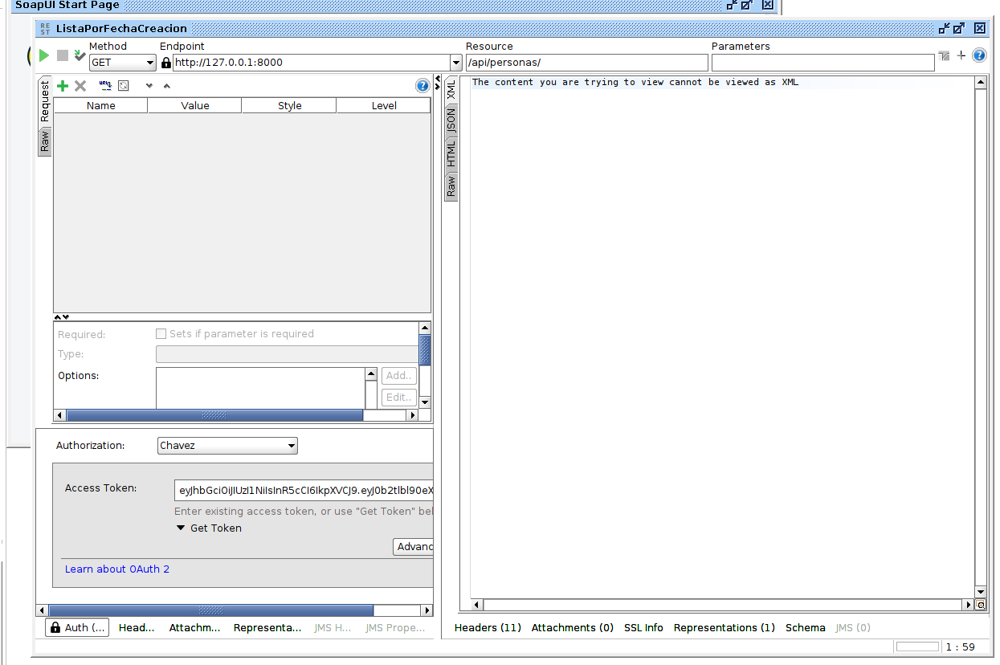

### Consultas
#### 3.1. Listar Personas por fecha de creación


#### 3.2. Ordenar por DNI, Apellido Paterno y Materno
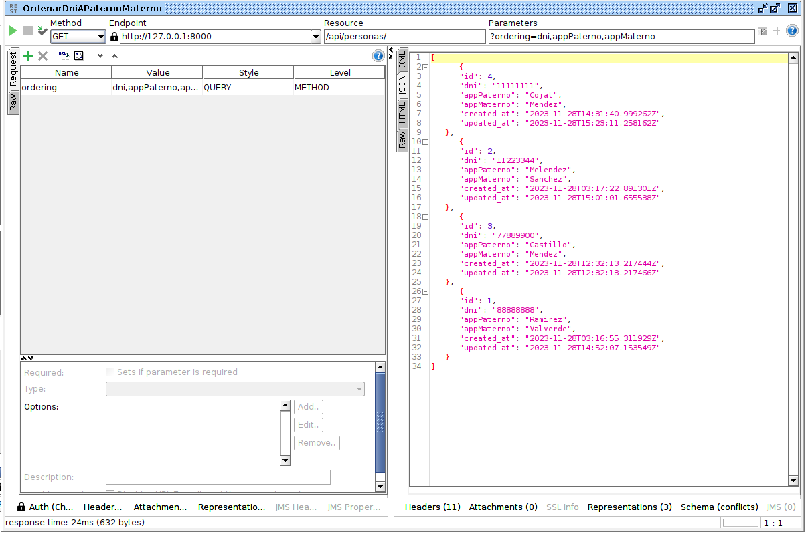

#### 3.3. Consultar persona por DNI
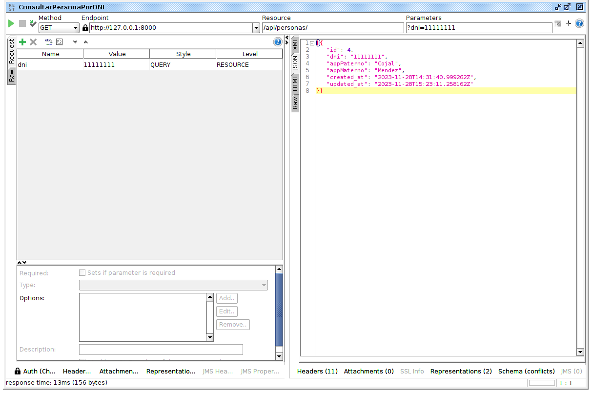

#### 3.4. Registrar persona
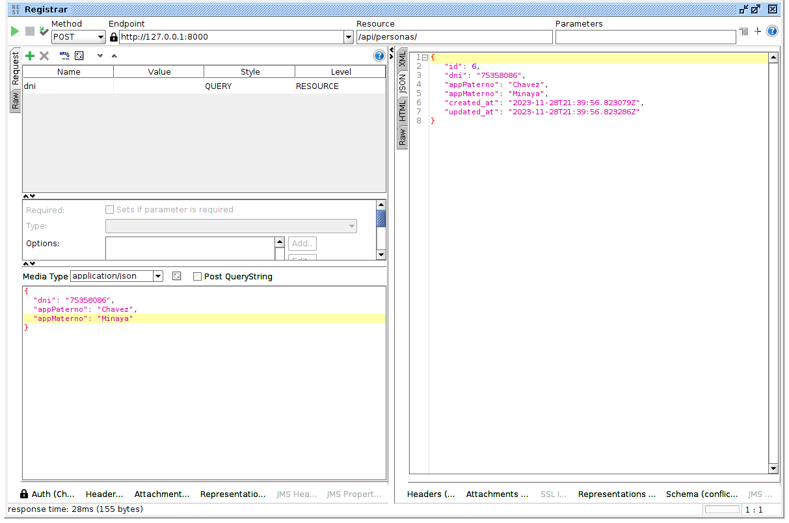

#### 3.5. Actualizar datos de Persona
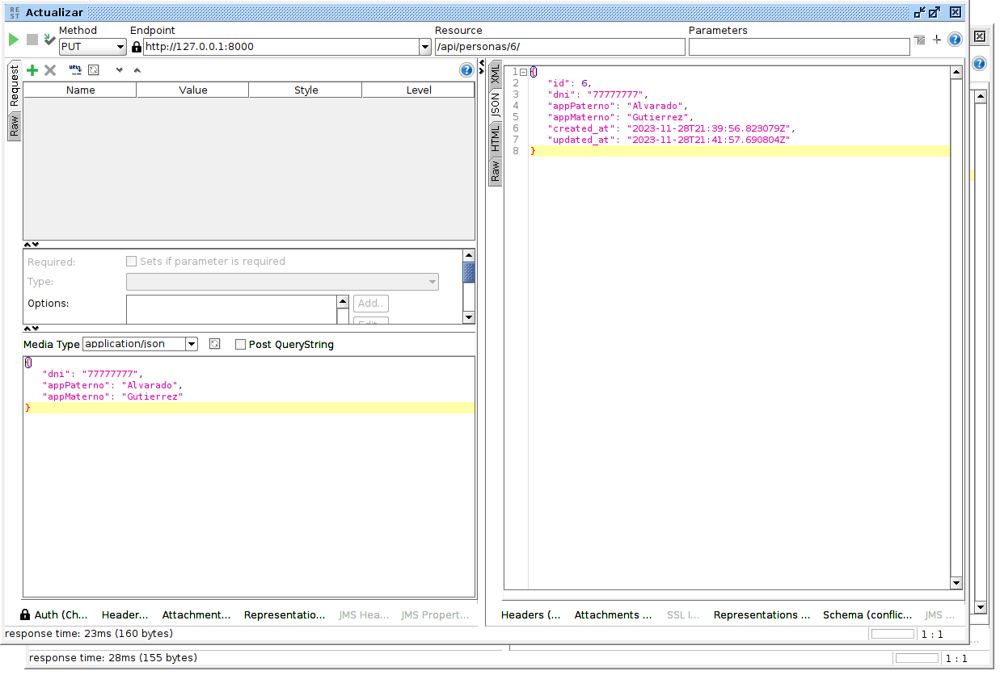

#### 3.6. Consultar persona por ID
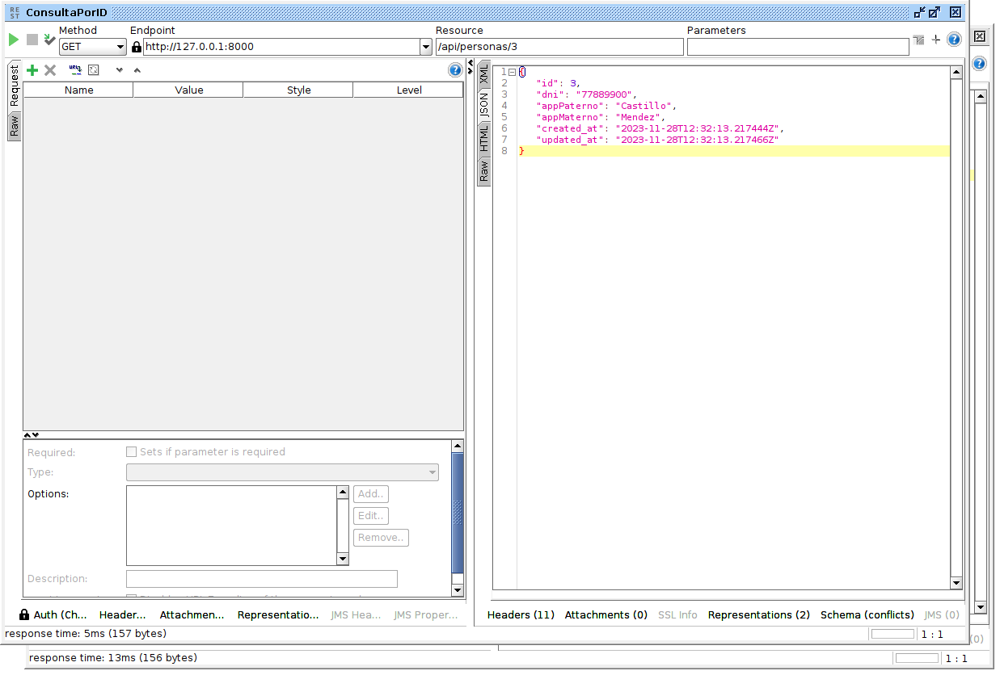

#### 3.7. Consultar persona por DNI
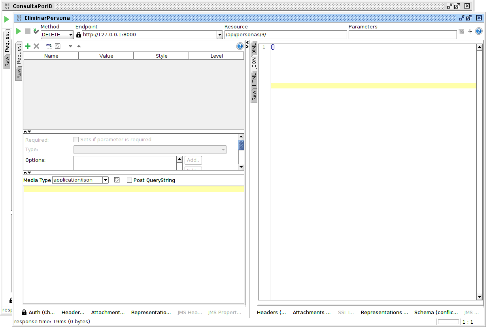

#### 3.8. Actualizar solo registro con Patch para datos persona
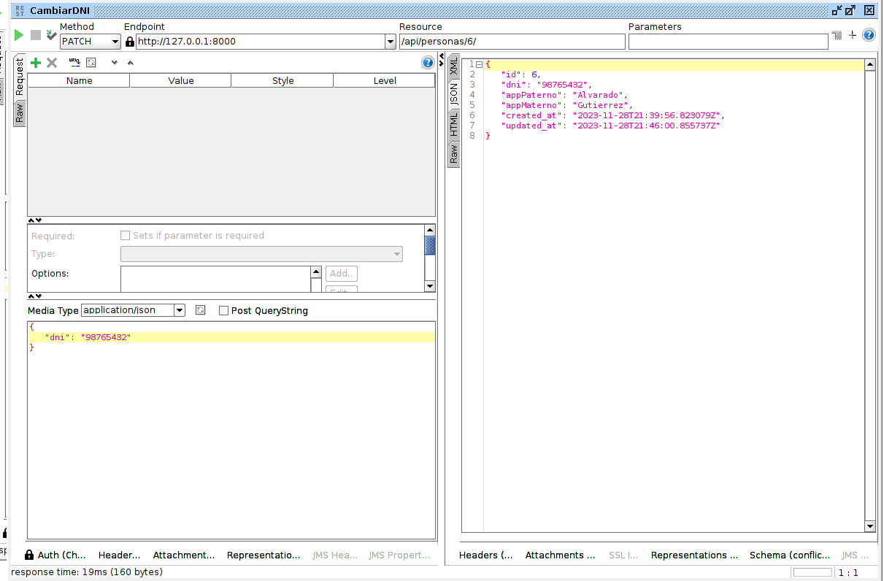
